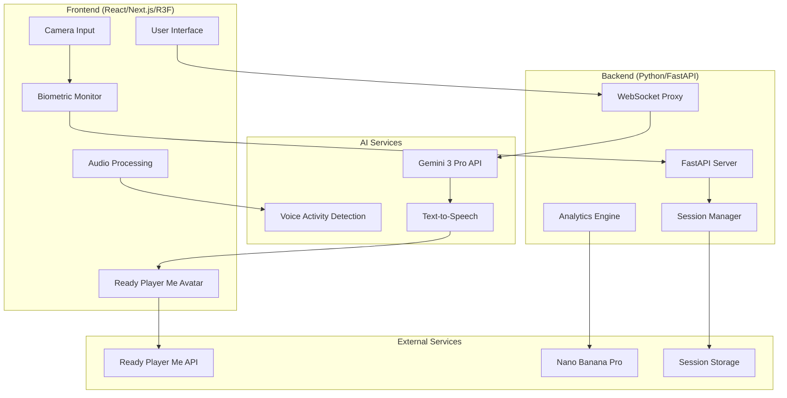

# Design notes for Socratic Mirror hackathon project.
# Design Document: Socratic Mirror Agent

## Overview

The Socratic Mirror Agent is a high-frequency multimodal AI coaching system that provides real-time biometric feedback through 3D avatar interaction. The system combines cutting-edge web technologies with advanced AI to create an immersive coaching experience that adapts to user physiological and behavioral patterns.

The architecture follows a real-time pipeline design with three core layers:
1. **Frontend Layer**: React/Next.js/R3F with Ready Player Me avatars and biometric processing
2. **Intelligence Layer**: Python/FastAPI backend with Gemini 3 Pro integration
3. **Persistence Layer**: Session management with context compression and user analytics

## Architecture

### System Architecture Diagram



### Real-Time Data Flow

The system operates on a high-frequency loop (30-60fps) with multiple concurrent data streams:

1. **Biometric Stream**: Camera → MediaPipe → rPPG Processing → Stress Detection
2. **Audio Stream**: Microphone → VAD → Gemini API → PCM Audio → Lip-Sync
3. **Visual Stream**: Avatar Rendering → Gesture Animation → Viseme Morphing
4. **Intelligence Stream**: Context Analysis → Coaching Decision → Barge-In Logic

## Components and Interfaces

### Frontend Components

#### BiometricMonitor Component
```typescript
interface BiometricData {
  heartRate: number;
  stressLevel: 'low' | 'medium' | 'high';
  gazeDirection: Vector3;
  postureScore: number;
  confidenceLevel: number;
}

interface BiometricMonitorProps {
  onBiometricUpdate: (data: BiometricData) => void;
  samplingRate: number; // 30fps default
  stressThreshold: number; // 20% above baseline
}
```

**Key Responsibilities:**
- Capture video stream from user camera
- Apply rolling mean subtraction to remove DC component (static skin color)
- Process green channel for rPPG heart rate detection with AC component isolation
- Apply 2nd-order IIR Butterworth filter (0.7Hz - 3.0Hz)
- Track gaze and posture using MediaPipe
- Implement hysteresis for stress state detection
- Send only computed metrics to backend (not raw video)

#### AvatarController Component
```typescript
interface AvatarState {
  expression: 'neutral' | 'encouraging' | 'skeptical' | 'concerned';
  gesture: 'pointing' | 'explaining' | 'listening' | 'thinking';
  lipSyncData: VisemeWeights;
  eyeContact: boolean;
}

interface VisemeWeights {
  [key: string]: number; // Oculus viseme morph targets
}
```

**Key Responsibilities:**
- Load and render Ready Player Me avatar
- Process 24kHz PCM audio from Gemini API
- Map audio amplitude to viseme weights with linear interpolation
- Maintain 150ms jitter buffer with silence injection
- Animate contextual gestures based on coaching mode
- Handle real-time expression changes for barge-in events

#### AudioProcessor Component
```typescript
interface AudioConfig {
  sampleRate: 24000; // 24kHz PCM
  bufferSize: 150; // 150ms adaptive jitter buffer (expands to 200ms if ping > 100ms)
  vadSensitivity: number; // Configurable VAD threshold
  adaptiveBuffering: boolean; // Enable dynamic buffer adjustment
}

interface AudioEvents {
  onSpeechStart: () => void;
  onSpeechEnd: () => void;
  onBargeInTrigger: (reason: string) => void;
}
```

**Key Responsibilities:**
- Capture user microphone input
- Implement configurable Voice Activity Detection
- Stream audio to Gemini API via WebSocket
- Process incoming PCM audio for avatar lip-sync
- Detect communication patterns (filler words, pauses)
- Trigger barge-in events based on combined biometric + audio analysis

### Backend Components

#### CoachingEngine
```python
class CoachingMode(Enum):
    TUTORING = "socratic_tutor"
    PUBLIC_SPEAKING = "evaluative_judge" 
    INTERVIEW = "skeptical_recruiter"

class CoachingEngine:
    def __init__(self, gemini_client: GeminiClient):
        self.gemini = gemini_client
        self.session_manager = SessionManager()
        self.barge_in_detector = BargeInDetector()
    
    async def process_interaction(
        self, 
        audio_data: bytes,
        biometric_data: BiometricData,
        mode: CoachingMode
    ) -> CoachingResponse
```

**Key Responsibilities:**
- Manage Gemini 3 Pro API integration with thinking levels
- Implement Socratic method response generation
- Process barge-in triggers and generate corrective feedback
- Apply context compression with Thinking Signatures
- Generate mode-specific personas and scenarios

#### SessionManager
```python
class SessionState:
    user_id: str
    session_id: str
    start_time: datetime
    context_history: List[Message]
    biometric_baseline: BiometricBaseline
    learning_objectives: List[str]
    pedagogical_state: ThinkingSignature

class SessionManager:
    async def create_session(self, user_id: str, mode: CoachingMode) -> Session
    async def resume_session(self, session_id: str) -> Session
    async def compress_context(self, session: Session) -> CompressedContext
    async def generate_vibe_report(self, session: Session) -> VibeReport
```

**Key Responsibilities:**
- Maintain 24-hour session resumption capability
- Implement sliding window context compression
- Preserve Thinking Signatures for pedagogical continuity
- Track user performance metrics and biometric baselines
- Generate comprehensive post-session analysis

#### BargeInDetector
```python
class BargeInTrigger:
    trigger_type: str  # "filler_words", "stress_spike", "gaze_away"
    confidence: float
    biometric_context: BiometricData
    audio_context: AudioAnalysis

class BargeInDetector:
    def analyze_communication_patterns(
        self, 
        audio: AudioData, 
        biometrics: BiometricData
    ) -> Optional[BargeInTrigger]
```

**Key Responsibilities:**
- Analyze real-time audio for filler words and speech patterns
- Correlate biometric stress indicators with communication quality
- Implement configurable sensitivity thresholds
- Generate contextual corrective feedback
- Coordinate with avatar for immediate visual response

### AI Integration Layer

#### GeminiClient
```python
class GeminiConfig:
    thinking_level: str = "low"  # For real-time, "high" for analysis
    temperature: float = 0.7
    max_tokens: int = 1000
    stream: bool = True

class GeminiClient:
    async def stream_conversation(
        self, 
        messages: List[Message],
        config: GeminiConfig
    ) -> AsyncIterator[GeminiResponse]
    
    async def generate_persona(
        self, 
        document_content: str,
        mode: CoachingMode
    ) -> PersonaConfig
```

**Key Responsibilities:**
- Maintain WebSocket connection to Gemini 3 Pro
- Switch thinking levels based on interaction type
- Generate custom personas from uploaded documents
- Implement Socratic method response patterns
- Handle context compression and restoration

## Data Models

### Core Data Structures

#### User Profile
```python
@dataclass
class UserProfile:
    user_id: str
    mizzou_affiliation: str  # student, faculty, alumni
    academic_program: Optional[str]
    biometric_baseline: BiometricBaseline
    coaching_preferences: CoachingPreferences
    performance_history: List[SessionSummary]
```

#### Biometric Baseline
```python
@dataclass
class BiometricBaseline:
    resting_heart_rate: float
    stress_threshold: float  # 20% above baseline
    gaze_pattern: GazeProfile
    posture_baseline: PostureMetrics
    calibration_date: datetime
```

#### Session Data
```python
@dataclass
class SessionData:
    session_id: str
    user_id: str
    mode: CoachingMode
    start_time: datetime
    duration: timedelta
    biometric_timeline: List[BiometricSnapshot]
    interaction_log: List[Interaction]
    barge_in_events: List[BargeInEvent]
    performance_metrics: PerformanceMetrics
    context_state: ThinkingSignature
```

#### Avatar Configuration
```python
@dataclass
class AvatarConfig:
    rpm_avatar_id: str
    personality_traits: Dict[str, float]
    gesture_library: List[GestureDefinition]
    expression_mappings: Dict[CoachingMode, ExpressionSet]
    voice_characteristics: VoiceProfile
```

### Mizzou-Specific Data

#### Campus Context
```python
@dataclass
class MizzouContext:
    landmarks: List[str] = [
        "Lafferre Hall", "The Columns", "Jesse Hall", 
        "Student Center", "Engineering Building"
    ]
    academic_programs: List[str]
    campus_events: List[CampusEvent]
    local_references: Dict[str, str]
```

#### Future Self Visualization
```python
@dataclass
class FutureVisualization:
    peak_confidence_frame: BiometricSnapshot
    success_scenario: str
    campus_location: str = "Lafferre Hall atrium"  # Cinematic glass-and-brick architecture
    audience_context: str
    image_prompt: str  # Includes "Cinematic lighting in the Lafferre Hall atrium"
    generated_image_url: str
```

## Error Handling

### Biometric Processing Errors
- **Camera Access Denied**: Graceful degradation to audio-only mode
- **Poor Lighting Conditions**: Automatic exposure adjustment and user guidance
- **MediaPipe Failures**: Fallback to simplified tracking with user notification
- **Heart Rate Anomalies**: Baseline recalibration and medical disclaimer

### Audio Processing Errors
- **Microphone Issues**: Clear user feedback and troubleshooting steps
- **Network Latency**: Dynamic buffer adjustment and quality degradation
- **VAD False Positives**: Adaptive threshold adjustment based on environment
- **Gemini API Failures**: Local fallback responses and reconnection logic

### Avatar Rendering Errors
- **WebGL Compatibility**: Fallback to 2D interface with feature notification
- **Ready Player Me API Issues**: Local avatar caching and offline mode
- **Lip-Sync Desynchronization**: Automatic recalibration and buffer adjustment
- **Performance Degradation**: Dynamic quality scaling based on device capabilities

### Session Management Errors
- **Context Compression Failures**: Graceful degradation with user notification
- **Session Restoration Issues**: New session creation with progress preservation
- **Storage Quota Exceeded**: Automatic cleanup of old sessions
- **Network Disconnections**: Offline mode with sync on reconnection

## Testing Strategy

*A property is a characteristic or behavior that should hold true across all valid executions of a system—essentially, a formal statement about what the system should do. Properties serve as the bridge between human-readable specifications and machine-verifiable correctness guarantees.*

The testing strategy combines comprehensive unit testing for specific scenarios with property-based testing for universal system behaviors. This dual approach ensures both concrete functionality and general correctness across all possible inputs.

### Property-Based Testing

Property-based testing will validate universal behaviors using a JavaScript property testing library like fast-check. Each test will run a minimum of 100 iterations to ensure comprehensive coverage through randomization.

### Unit Testing Strategy

Unit tests will focus on:
- **Integration Points**: WebSocket connections, API integrations, avatar loading
- **Edge Cases**: Network failures, extreme biometric values, malformed audio
- **Specific Examples**: Known good/bad communication patterns, calibration scenarios
- **Error Conditions**: Graceful degradation, fallback behaviors, user notifications

The testing approach balances comprehensive input coverage through property tests with targeted validation of critical integration points and edge cases through unit tests. Together, they provide confidence in both general system correctness and specific implementation details.

### Correctness Properties

Based on the prework analysis and property reflection, the following properties validate the universal behaviors of the Socratic Mirror Agent system:

**Property 1: Biometric Pipeline Integrity**
*For any* video input stream, the biometric monitor should capture heart rate using rPPG processing, apply 2nd-order IIR Butterworth filtering, and maintain 30fps MediaPipe tracking while sending only computed metrics to optimize API costs
**Validates: Requirements 1.1, 1.2, 1.3, 1.4**

**Property 2: Stress Detection Hysteresis**
*For any* heart rate pattern, when heart rate exceeds baseline by 20% for more than 5 consecutive seconds, the system should flag elevated stress state and only clear the flag when heart rate returns to within 5% of baseline
**Validates: Requirements 1.5**

**Property 3: Multi-Modal Barge-In Triggering**
*For any* combination of filler words, elevated BPM, and gaze direction, the system should trigger barge-in events when communication quality indicators align, interrupt user speech, and force reset before continuation
**Validates: Requirements 2.1, 2.2, 2.3**

**Property 4: Configurable VAD Sensitivity**
*For any* VAD sensitivity configuration, the system should adjust speech detection thresholds accordingly and analyze communication patterns in real-time when speech is detected
**Validates: Requirements 2.4, 2.5**

**Property 5: Socratic Method Enforcement**
*For any* direct question from a user, the tutoring system should respond only with leading questions, activate deep thinking mode, and adapt explanation approach based on detected confusion patterns
**Validates: Requirements 3.1, 3.3, 3.4**

**Property 6: Avatar Contextual Behavior**
*For any* coaching mode and explanation content, the avatar should display appropriate gestures toward 3D whiteboard, match mode-specific expressions (skeptical for interviews, encouraging for tutoring), and perform contextual body language
**Validates: Requirements 3.2, 4.2, 5.4**

**Property 7: Context Compression with State Preservation**
*For any* tutoring session exceeding 30 minutes, the system should apply sliding window context compression while preserving Thinking Signatures, learning objectives, and pedagogical reasoning state
**Validates: Requirements 3.5, 6.3, 6.4**

**Property 8: Dynamic Persona Generation**
*For any* uploaded PDF or URL content, the system should generate custom interviewer personas, select challenging topics for public speaking mode, and incorporate document-specific context into scenarios
**Validates: Requirements 4.1, 4.3**

**Property 9: Performance-Based Avatar Reactions**
*For any* user performance metrics, the avatar should display appropriate non-verbal cues (yawning for poor performance, nodding for good performance) and adjust behavior based on detected engagement levels
**Validates: Requirements 4.4**

**Property 10: Audio-Visual Synchronization**
*For any* 24kHz PCM audio stream from Gemini API, the system should generate lip-sync data using Oculus viseme morph targets with linear interpolation, maintain 150ms jitter buffer, and inject silence for dropped packets
**Validates: Requirements 5.1, 5.2, 5.3, 5.5**

**Property 11: Session Lifecycle Management**
*For any* session interruption, the system should preserve context for up to 24 hours, restore conversation context and user progress on resumption, and ensure secure persistence of all interaction data
**Validates: Requirements 6.1, 6.2, 6.5**

**Property 12: Real-Time Performance Optimization**
*For any* live interaction, the system should maintain WebSocket connection to Gemini 3 Pro, use low thinking level for minimal TTFT, prioritize response speed over deep reasoning, and maintain 24kHz PCM audio quality
**Validates: Requirements 7.1, 7.2, 7.4, 7.5**

**Property 13: VAD Speech Detection**
*For any* audio input and sensitivity configuration, the VAD should detect speech activity with configurable thresholds and trigger appropriate system responses
**Validates: Requirements 7.3**

**Property 14: Mizzou Context Integration**
*For any* generated scenario, interview persona, or example, the system should incorporate Mizzou campus landmarks, reference appropriate curriculum and academic programs, and use local terminology when campus integration is enabled
**Validates: Requirements 8.1, 8.2, 8.3, 8.5**

**Property 15: Future Self Visualization**
*For any* session conclusion, the system should generate Future_Self_Images placing users in recognizable Mizzou settings like Lafferre Hall with photorealistic 4K quality
**Validates: Requirements 8.4, 9.4**

**Property 16: Comprehensive Performance Analysis**
*For any* completed session, the system should generate a "Vibe Report" using high thinking level, identify Peak Confidence Frame based on biometric data, and correlate biometric patterns with communication performance metrics
**Validates: Requirements 9.1, 9.2, 9.5**

**Property 17: Motivational Content Generation**
*For any* session requiring motivational content, the system should generate Future_Self_Images using Nano Banana Pro with appropriate success visualization
**Validates: Requirements 9.3**

**Property 18: System Architecture Reliability**
*For any* system startup, the frontend should initialize React/Next.js/R3F with Ready Player Me integration, the backend should handle WebSocket connections efficiently, and maintain reliable connection to Gemini 3 Pro API
**Validates: Requirements 10.1, 10.2, 10.3**

**Property 19: Biometric Processing Performance**
*For any* biometric data processing load, the system should handle MediaPipe and rPPG calculations without performance degradation
**Validates: Requirements 10.4**

**Property 20: Scalable Response Performance**
*For any* usage scale, the system should maintain sub-200ms response times for real-time interactions
**Validates: Requirements 10.5**

### Unit Testing Strategy

Unit tests will complement property-based testing by focusing on specific scenarios and integration points:

**Biometric Processing Tests:**
- Test rPPG heart rate detection with known video patterns
- Verify MediaPipe landmark detection accuracy
- Test filter response with synthetic signal data
- Validate stress detection threshold calculations

**Avatar Integration Tests:**
- Test Ready Player Me avatar loading and initialization
- Verify viseme morph target mapping accuracy
- Test gesture animation timing and coordination
- Validate lip-sync synchronization with known audio

**AI Integration Tests:**
- Test Gemini API connection establishment and recovery
- Verify persona generation from sample documents
- Test Socratic method response patterns
- Validate context compression and restoration

**Session Management Tests:**
- Test session creation, persistence, and resumption
- Verify data security and encryption
- Test concurrent session handling
- Validate cleanup and storage management

**Error Handling Tests:**
- Test graceful degradation scenarios
- Verify fallback behavior for component failures
- Test network disconnection recovery
- Validate user notification systems

### Property-Based Testing Configuration

The system will use **fast-check** for JavaScript/TypeScript property-based testing with the following configuration:

- **Minimum 100 iterations** per property test for comprehensive coverage
- **Custom generators** for biometric data, audio patterns, and avatar states
- **Shrinking strategies** for complex failure cases
- **Timeout handling** for real-time property validation

Each property test will be tagged with comments referencing the design document:
```javascript
// Feature: socratic-mirror-agent, Property 1: Biometric Pipeline Integrity
// Feature: socratic-mirror-agent, Property 10: Audio-Visual Synchronization
```

**Test Data Generation:**
- **Biometric generators**: Heart rate patterns, gaze trajectories, posture data
- **Audio generators**: Speech patterns, filler words, silence periods
- **Avatar generators**: Expression states, gesture sequences, viseme weights
- **Session generators**: Context histories, user interactions, performance metrics

The dual testing approach ensures both universal correctness through property validation and specific reliability through targeted unit tests, providing comprehensive coverage for this complex multimodal system.